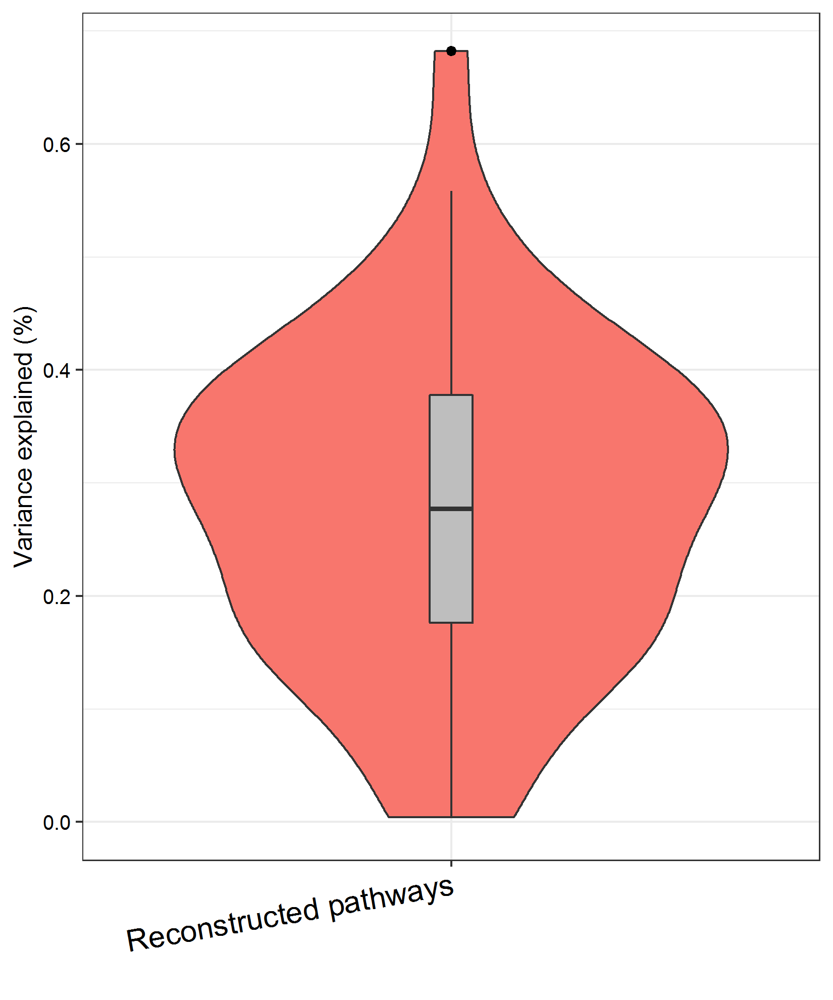
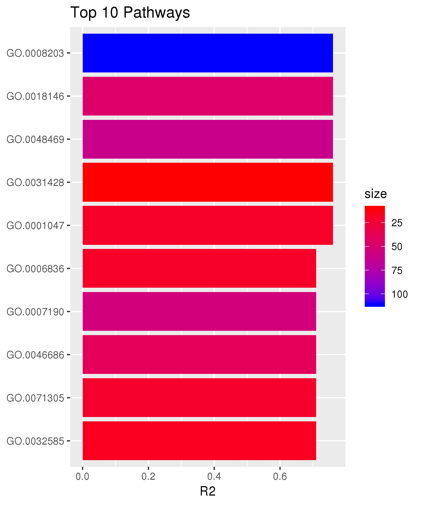

```{r style, echo = FALSE, results = 'asis'}
BiocStyle::markdown()
```
```{r global_options, include=FALSE}  
knitr::opts_chunk$set(message=FALSE, error=FALSE, warning=FALSE, fig.width=8, 
fig.height=8)
options(width=100) 
```


# Overview
## Motivation
The identification of reproducible biological patterns from high-dimensional 
omics data is a key factor in understanding the biology of complex disease or 
traits. Incorporating prior biological knowledge into machine learning is an 
important step in advancing such research.

## Deliverables
We have implemented a biologically informed multi-stage machine learing 
framework termed __BioMM__ [1] specifically for phenotype prediction using 
omics-scale data based on biological prior information.   

**Features of BioMM in a nutshell**:   

1. Applicability for all omics data modalities.   
2. Different biological stratification strategies.    
3. Prioritizing outcome-associated functional patterns.   
4. End-to-end prediction at the individual level based on biological 
stratified patterns.   
5. Possibility for extension to machine learning models of interest.   
6. Parallel computing. 

# Getting started  

## Installation 
Development version from Github:

*  Install BioMM in R
```{r eval=FALSE}
if (!requireNamespace("BiocManager", quietly = TRUE))
    install.packages("BiocManager")
BiocManager::install("transbioZI/BioMM") 
```
 
* Load required libraries
```{r loadPkg, eval=TRUE, results="hide"}
library(BioMM)  
library(BiocParallel)  
library(ranger)
library(rms) 
library(glmnet) 
library(e1071) 
library(variancePartition)  
```

# Omics data 
A wide range of genome-wide omics data is supported for the use of BioMM 
including whole-genome DNA methylation, gene expression and genome-wide SNP 
data. Other types of omics data that can map into genes, pathways or 
chromosomes are also encouraging.  
For better understanding of the framework, we used a preprocessed genome-wide 
DNA methylation data with 26486 CpGs and 40 samples consisting of 20 controls 
and 20 patients. (0: healthy control and 1: patient) for demonstration.  

```{r studyData, eval=TRUE}
## Get DNA methylation data 
studyData <- readRDS(system.file("extdata", "/methylData.rds", 
                     package="BioMM"))
head(studyData[,1:5])
dim(studyData)
``` 

# Feature stratification
Features like CpGs and SNPs can be mapped into genes, pathways and chromosomes 
based on genomic location and gene ontology categories, as implemented in 
three different functions `omics2genelist()`, `omics2pathlist()` and 
`omics2chrlist()`. The choice of feature stratification method depends on the 
research questions and objectives. 

```{r annotationFile, eval=TRUE}
## Load annotation data
featureAnno <- readRDS(system.file("extdata", "cpgAnno.rds", package="BioMM")) 
pathlistDB <- readRDS(system.file("extdata", "goDB.rds", package="BioMM")) 
head(featureAnno)
str(pathlistDB[1:3])
``` 

```{r chrlist, eval=TRUE} 
## Map to chromosomes
chrlist <- omics2chrlist(data=studyData, probeAnno=featureAnno) 
``` 

```{r pathlist, eval=TRUE} 
## Map to pathways (input 100 pathways only)
pathlistDBsub <- pathlistDB[1:100]
pathlist <- omics2pathlist(data=studyData, pathlistDBsub, featureAnno, 
                           restrictUp=100, restrictDown=20, minPathSize=10) 
``` 
 
```{r genelist, eval=FALSE} 
## Map to genes 
studyDataSub <- studyData[,1:2000]
genelist <- omics2genelist(data=studyDataSub, featureAnno, 
                           restrictUp=200, restrictDown=2) 
``` 
# BioMM framework

## Introduction
Briefly, the BioMM framework consists of two learning stages [1]. During the 
first stage, biological meta-information is used to 'compress' the variables 
of the original dataset into functional-level 'latent variables' (henceforth 
called stage-2 data) using either supervised or unsupervised learning models. 
In the second stage, a supervised model is built using the stage-2 data with 
non-negative outcome-associated features for prediction. 

## End-to-end prediction modules
### Interface to machine learning models 
The end-to-end prediction is performed using `BioMM()` function. Both 
supervised and unsupervised learning are implemented in the BioMM framework, 
which are indicated by the argument `supervisedStage1=TRUE` or 
`supervisedStage1=FALSE`. Commonly used supervised classifiers: generalized 
regression models with lasso, ridge or elastic net regularization (GLM) [4], 
support vector machine (SVM) [3] and random forest [2] are included. For the 
unsupervised method, regular or sparse constrained principal component 
analysis (PCA) [5] is used. Generic resampling methods include 
cross-validation (CV) and bootstrapping (BS) procedures as the argument 
`resample1="CV"` or `resample1="BS"`. Stage-2 data is reconstructed using 
either resampling methods during machine learning prediction or independent 
test set prediction if the argument `testData` is provided.

#### Example  
To apply random forest model, we use the argument `classifier1=randForest` and 
`classifier2=randForest` in `BioMM()` with the classification mode at both 
stages. `predMode1` and `predMode2` indicate the prediction type, here we use 
classification for binary outcome prediction. A set of model hyper-parameters 
are supplied by the argument `paramlist1` at stage 1 and `paramlist2` at 
stage 2. Chromosome-based stratification is carried out in this example. We 
focused on the autosomal region to limit the potential influence of sex on 
machine learning due to the phenomenon of X chromosome inactivation or the 
existence of an additional X chromosome in female samples. Therefore it's 
suggested to exclude sex chromosome in the user-supplied `featureAnno` input 
file.

```{r BioMMrandForest, eval=TRUE}
## Parameters
supervisedStage1=TRUE
classifier1=classifier2 <- "randForest"
predMode1=predMode2 <- "classification"
paramlist1=paramlist2 <- list(ntree=300, nthreads=10)   
param1 <- MulticoreParam(workers = 1)
param2 <- MulticoreParam(workers = 10)

studyDataSub <- studyData[,1:2000] ## less computation
result <- BioMM(trainData=studyDataSub, testData=NULL,
                stratify="chromosome", pathlistDB, featureAnno, 
                restrictUp=10, restrictDown=200, minPathSize=10, 
                supervisedStage1, typePCA="regular", 
                resample1="BS", resample2="CV", dataMode="allTrain", 
                repeatA1=50, repeatA2=1, repeatB1=20, repeatB2=1, 
                nfolds=10, FSmethod1=NULL, FSmethod2=NULL, 
                cutP1=0.1, cutP2=0.1, fdr1=NULL, fdr2=NULL, FScore=param1, 
                classifier1, classifier2, predMode1, predMode2, 
                paramlist1, paramlist2, innerCore=param2,  
                outFileA2=NULL, outFileB2=NULL)
print(result)
``` 

Other machine learning models can be employed with the following respective 
parameter settings. For the classifier `"SVM"`, parameters can be tuned using 
an internal cross validation if `tuneP=TRUE`. For generalized regression model 
`glmnet`, elastic net is specified by the input argument `alpha=0.5`. 
Alternatively, `alpha=1` is for the lasso and `alpha=0` is the ridge. For the 
unsupervised learning `supervisedStage1=FALSE`, regular PCA 
`typePCA="regular"` is applied and followed with random forest classification 
`classifier2=TRUE`.

```{r BioMMpara, eval=TRUE}
## SVM 
supervisedStage1=TRUE
classifier1=classifier2 <- "SVM"
predMode1=predMode2 <- "classification"
paramlist1=paramlist2 <- list(tuneP=FALSE, kernel="radial", 
                              gamma=10^(-3:-1), cost=10^(-3:1))

## GLM with elastic-net
supervisedStage1=TRUE
classifier1=classifier2 <- "glmnet"
predMode1=predMode2 <- "classification" 
paramlist1=paramlist2 <- list(family="binomial", alpha=0.5, 
                              typeMeasure="mse", typePred="class")

## PCA + random forest
supervisedStage1=FALSE
classifier2 <- "randForest"
predMode2 <- "classification"
paramlist2 <- list(ntree=300, nthreads=10)  
```


### Interface to biological stratification strategies
For stratification of predictors using biological information, various 
strategies can be applied. Currently, `BioMM()` integrates three different 
ways of stratification. Gene-based prediction is defined by the argument 
`stratify="gene"`, which can be used when multiple predictors exist within 
one gene. For instance, DNA methylation or GWAS data, each gene might have 
multiple CpGs or SNPs. But this is not applicable for gene expression data. 
Pathway-based analysis is described by the argument `stratify="pathway"`, 
which would account for epistasis between variables within the functional 
category; therefore, this may provide better information on functional 
insight. Chromosome-based analysis `stratify="chromosome"` might be helpful 
to cover non-coding features residing on each chromosome apart from the 
coding region probes.

#### Example
End-to-end prediction based on pathway-wide stratification on genome-wide DNA 
methylation data is demonstrated below. PCA is used at stage-1 to reconstruct 
pathway level data, then the random forest model with 10-fold cross validation
is applied on stage-2 data to estimate the prediction performance.

```{r BioMMpathway, eval=TRUE}
## Parameters
supervisedStage1=FALSE
classifier <- "randForest"
predMode <- "classification"
paramlist <- list(ntree=300, nthreads=10)   
param1 <- MulticoreParam(workers = 1)
param2 <- MulticoreParam(workers = 10)

result <- BioMM(trainData=studyData, testData=NULL,
                stratify="pathway", pathlistDBsub, featureAnno, 
                restrictUp=100, restrictDown=10, minPathSize=10, 
                supervisedStage1, typePCA="regular", 
                resample1="BS", resample2="CV", dataMode="allTrain", 
                repeatA1=40, repeatA2=1, repeatB1=40, repeatB2=1, 
                nfolds=10, FSmethod1=NULL, FSmethod2=NULL, 
                cutP1=0.1, cutP2=0.1, fdr1=NULL, fdr2=NULL, FScore=param1, 
                classifier1, classifier2, predMode1, predMode2, 
                paramlist1, paramlist2, innerCore=param2,  
                outFileA2=NULL, outFileB2=NULL)
print(result)
``` 

## Stage-2 data exploration 
### Reconstruction
Here we demonstrate using supervised random forest method on genome-wide DNA 
methylation. Gene ontological pathways are used for the generation of stage-2 
data.

```{r stage2data, eval=TRUE}
## Pathway level data or stage-2 data prepared by BioMMreconData()
stage2dataA <- readRDS(system.file("extdata", "/stage2dataA.rds", 
                       package="BioMM"))

head(stage2dataA[,1:5])
dim(stage2dataA)
``` 

```{r stage2dataAprepare, eval=FALSE} 
#### Alternatively, 'stage2dataA' can be created by the following code:
## Parameters  
classifier <- "randForest" 
predMode <- "probability" 
paramlist <- list(ntree=300, nthreads=40)  
param1 <- MulticoreParam(workers = 1)
param2 <- MulticoreParam(workers = 10) 
set.seed(123)
## This will take a bit longer to run
stage2dataA <- BioMMreconData(trainDataList=pathlist, testDataList=NULL,
                            resample="BS", dataMode="allTrain",
                            repeatA=25, repeatB=1, nfolds=10,
                            FSmethod=NULL, cutP=0.1, fdr=NULL, FScore=param1,
                            classifier, predMode, paramlist,
                            innerCore=param2, outFileA=NULL, outFileB=NULL)

``` 

### Visualization
#### Explained variation of stage-2 data
The distribution of the proportion of variance explained for the individual 
generated feature of stage-2 data for the classification task is illustrated 
`plotVarExplained()` below. Nagelkerke pseudo R-squared measure is used to 
compute the explained variance. The argument `posF=TRUE` indicates that only 
positively outcome-associated features are plotted, since negative 
associations likely reflect random effects in the underlying data [6].

``` {r stage2dataViz, eval=TRUE}
param <- MulticoreParam(workers = 1) 
plotVarExplained(data=stage2dataA, posF=TRUE, 
                 stratify="pathway", core=param, fileName=NULL)
``` 


#### Prioritization of outcome-associated functional patterns 
`plotRankedFeature()` is employed to rank and visualize the outcome-associated 
features from stage-2 data. The argument `topF=10` and `posF=TRUE` are used to 
define the top 10 positively outcome-associated features. Nagelkerke pseudo 
R-squared measure is utilized to evaluate the importance of the ranked 
features as indicated by the argument `rankMetric="R2"`. The size of the 
investigated pathway is pictured as the argument `colorMetric="size"`. 

``` {r topFstage2data, eval=TRUE} 
param <- MulticoreParam(workers = 1) 
plotRankedFeature(data=stage2dataA, 
                  posF=TRUE, topF=10, 
                  blocklist=pathlist, 
                  stratify="pathway",
                  rankMetric="R2", 
                  colorMetric="size", 
                  core=param, fileName=NULL)
``` 


## Computational consideration
BioMM with supervised models at both stages and gene or pathway based 
stratification methods will take longer to run than unsupervised
approaches or chromosome based stratification. But the prediction
is more powerful in many scenarios. Therefore, we suggest the former even
if the computation is more demanding, as the adoption of 5G is pushing advances 
in computational storage and speed. Parallel computing is implemented and 
recommended for such scenario. In this vignette, due to the runtime, we 
only showcased the smaller examples and models with less computation. 


# Session information

``` {r sessioninfo, eval=TRUE} 
sessionInfo()
```  

# References

[1] NIPS ML4H submission: Chen, J. and Schwarz, E., 2017. BioMM: 
Biologically-informed Multi-stage Machine learning for identification of 
epigenetic fingerprints. arXiv preprint arXiv:1712.00336. 

[2] Breiman, L. (2001). "Random forests." Machine learning 45(1): 5-32.

[3] Cortes, C., & Vapnik, V. (1995). "Support-vector networks." 
Machine learning 20(3): 273-297.

[4] Friedman, J., Hastie, T., & Tibshirani, R. (2010). "Regularization paths 
for generalized linear models via coordinate descent." 
Journal of statistical software 33(1): 1.

[5] Wold, S., Esbensen, K., & Geladi, P. (1987). "Principal component 
analysis." Chemometrics and intelligent laboratory systems 2(1-3): 37-52.

[6] Claudia Perlich and Grzegorz Swirszcz. On cross-validation and stacking: 
Building seemingly predictive models on random data. ACM SIGKDD Explorations 
Newsletter, 12(2):11-15, 2011. 

# Questions & Comments
If you have any questions or comments ? 

Contact: junfang.chen@zi-mannheim.de


